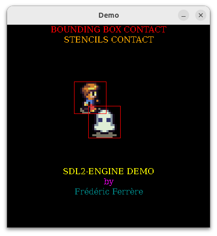

#  Common Lisp SDL2 Engine

This is a really simple Common Lisp SDL2 engine, a wrapper around SDL2.

## Dependencies

### SDL2
* [SDL2](https://www.libsdl.org/) and [SDL2_image](https://www.libsdl.org/projects/SDL_image/)
```sh
sudo apt install libsdl2-dev libsdl2-image-dev
```

### Common Lisp

* [SBCL](https://www.sbcl.org/)
* [Quicklisp](https://www.quicklisp.org/beta/)

## Install

Clone into your common lisp source directory (maybe $HOME/common-lisp)
```sh
git clone https://github.com/fferrere/sdl2-engine
```

Load from your LISP Repl
```lisp
(ql:quickload "sdl2-engine")
```

## Demo

```lisp
(ql:quickload "sdl2-engine/demo")
(sdl2-engine/demo:start)
```

Use :
- Arrow keys to move : left, right, up and down
- Space key to toggle bounding box display
- Esc to exit.

* [Code](demo/demo.lisp)
* [Artwork by Lanea Zimmerman](https://opengameart.org/content/tiny-16-basic)

## Examples

* [Glacial Mountains](https://github.com/fferrere/glacial-mountains)
* [Sorcery](https://github.com/fferrere/sorcery-sdl2)

## Engine

What you can do :
- Assets
  - sprites (sheet of sprites, tiles sheet)
  - stencils 
  - texts (Atlas texts)
- Controls
  - keyboard mapping functions
- Drawing
  - Sprites
  - Texts
  - Numbers
  - Lines
  - Rectangles
- Stencils
  - Create stencils from a sheet of sprites
- Collisions Detection
  - With Bounding Boxes
  - With Stencils
- Time control
  - With ticks helper macro
    
### How to start

- Create a stencils file

- Create an instance of the engine class
  - Initialise the following slots :
    - loop : handler function
    - width
    - height
    - quit (optional) : handler function
    - draw-color (optional)
```lisp
(make-instance 'engine :loop 'game-loop :width 800 :height 600)
```

- add assets
```lisp
(s2e:add-asset game :sprites *sprites-filename* 16 16)
```
- add controls
```lisp
(add-keyboard-mapping game :left 'move-left)
(add-keyboard-mapping game :right 'move-right)
(add-keyboard-mapping game :up 'move-up)
(add-keyboard-mapping game :down 'move-down)
(add-keyboard-mapping game :space 'display-bouding-boxes)
```
- loop handler
  - Must contains the game logic
    - Collision detection
    - drawing function
      - Maybe with some animation
    - Time Control

```lisp
(defun game-loop (game)
  (let ((x 40)
        (y 40)
        (index 55))
    (s2e:draw-sprite game :sprites index x y)))
```

### API
- [launch](#launch)
- [stop](#stop)
- [add-asset](#add-asset)
- [add-keyboard-mapping](#add-keyboard-mapping)
- [del-keyboard-mapping](#del-keyboard-mapping)
- [reset-keyboard-mapping](#reset-keyboard-mapping)
- [enable-keyboard-key](#enable-keyboard-key)
- [disable-keyboard-key](#disable-keyboard-key)
- [enable-keyboard-controls](#enable-keyboard-controls)
- [disable-keyboard-controls](#disable-keyboard-controls)
- [reset-asset](#reset-asset)
- [with-text-asset](#with-text-asset)
- [add-text](#add-text)
- [add-text-digits](#add-text-digits)
- [draw-sprite](#draw-sprite)
- [draw-text](#draw-text)
- [draw-texts](#draw-texts)
- [draw-number](#draw-number)
- [draw-rect](#draw-rect)
- [draw-line](#draw-line)
- [intersectp](#intersectp)
- [stencils-intersectp](#stencils-intersectp)
- [create-stencils](#create-stencils)
- [with-ticks](#with-ticks)


### Start and stop
#### [Method] launch<a id="launch"></a>

Launch a new game (within a thread)

```lisp
(launch engine title)
```
- engine : engine class object (or inherited)
- title :  a string

#### [Method] stop<a id="stop"></a>

Stop game (optional)

```lisp
(stop engine)
```
- engine : engine class object 

### Assets

An asset can be :
- A sprites sheet : same widht and height for all the sprites of the sheet
- A stencils sheet : same widht and height for all the stencils of the sheet
- A texts atlas

#### [Method] add-asset<a id="add-asset"></a>

Add a new asset to the engine

```lisp
(add-asset engine asset-name asset-filename width height &key (type :sprite) (mutablep nil))
```
- engine : engine class object 
- asset-name : a keyword name
- asset-filename
- width
- height
- type : a keyword, :sprite or :stencil
- mutablep : boolean, t or nil
  - A mutable asset 

#### [Method] reset-asset<a id="reset-asset"></a>
```lisp
(reset-asset engine asset-name)
```
- engine : engine class object 
- asset-name : a keyword name

#### Texts
- Texts are stored in text assets
- Texts in the same asset uses the same font
- Colors can be different
- Multiple assets may be used for translation or different font

#### Example

Build Text atlas
```lisp
(let ((engine (make-instance 'engine))
      (font-file #P"~/my-font.ttf")
      (font-size 16))
  (with-text-asset (engine asset 'game-texts font-file font-size)
     (add-text asset 'game-over "Game Over" #xF7 #XF7 0 0)
     (add-text asset 'win "You win" #xF7 0 #XF7 0)
     (add-text-digits asset 0 #XF7 0 0)))
```

Draw "Game Over"
```lisp
(draw-text engine 'game-texts 'game-over 100 100)
```


##### <a id="with-text-asset"></a>[Macro] with-text-asset
Add a text asset within then engine assets.
```lisp
(with-text-asset (engine asset asset-name font-file font-size) &body body)
```
- engine : engine class object 
- asset : a symbol
  - Used within the macro
- asset-name : a keyword
  - A name to identify the asset
- font-file : a pathname
  - The filepath 
- font-size : an integer
  - The font size
- body : see below

##### [Method] add-text<a id="add-text"></a>
Add text to the text asset
Use only inside macro [with-text-asset](#with-text-asset).
```lisp
(add-text asset id string red green blue alpha)
```
- asset : a symbol
  - Used within the macro
- id : a symbol 
  - Identify the text
- string : a string
  - The string to store into the text atlas
- red : an integer
- green : an integer
- blue : an integer
- alpha : an integer

##### [Method] add-text-digits<a id="add-text-digits"></a>
Use only inside macro [with-text-asset](#with-text-asset).

```lisp
(add-text-digits asset red green blue alpha)
```
- asset : a symbol
  - Used within the macro
- red : an integer
- green : an integer
- blue : an integer
- alpha : an integer


### Draw functions
#### [Method] draw-sprite<a id="draw-sprite"></a>
```lisp
(draw-sprite engine sheet-name index x y &key (scale-w 1) (scale-h 1))
```
- engine : engine class object 
- sheet-name : a keyword
- index : an integer
  - index of the sprite in the sprites sheet
- x : an integer
- y : an integer
- scale-w : an integer
  - Apply a zoom
  - scale-w > 1 : upscale
  - scale-w < 1 : downscale
- scale-h : an integer
  - Apply a zoom
  - scale-w > 1 : upscale
  - scale-w < 1 : downscale

#### [Method] draw-line<a id="draw-line"></a>
Draw line into the window or in a mutable sprites sheet identified by asset-name.

```lisp
(draw-line engine x1 y1 x2 y2 &key (asset-name nil) color)
```
- engine : engine class object 
- x1 : an integer
- y1 : an integer
- x2 : an integer
- y2 : an integer
- asset-name : a keyword
  - 
- color : a list of integers (r g b a)

#### [Method] draw-rect<a id="draw-rect"></a>
```lisp
(draw-rect engine x y w h &key color)
```
- engine : engine class object 
- x : an integer
- y : an integer
- w : an integer
- h : an integer
- color : a list of integers (r g b a)

##### [Method] draw-text<a id="draw-text"></a>
```lisp
(draw-text engine asset-name text-id x y &key (position :left))
```
- engine : engine class object 
- asset-name : a keyword
- text-id : a symbol
  - The ID of the text in the atlas text
- x : an integer
- y : an integer
- position : a keyword, :left or :center

##### [Method] draw-texts<a id="draw-texts"></a>
```lisp
(draw-texts engine asset-name texts-id x y &key (position :left))
```
- engine : engine class object 
- asset-name : a keyword
- texts-id : a list of symbols
  - The IDs of the texts in the atlas text
- x : an integer
- y : an integer
- position : a keyword, :left or :center

##### [Method] draw-number<a id="draw-number"></a>
```lisp
(draw-number engine asset-name number x y)
```
- engine : engine class object 
- asset-name : a keyword
- number : an integer
- x : an integer
- y : an integer

### Keyboard
#### [Method] add-keyboard-mapping<a id="add-keyboard-mapping"></a>
Add a control keyboard 

```lisp
(add-keyboard-mapping engine key handler)
```
- engine : engine class object
- key : a keyword
  - matching a keyboard key, ex :space for the SPACE key
- handler : a function with 2 args, engine and key-status
  - key-status :
    - :down if key pressed
    - :up  if key released

#### [Method] del-keyboard-mapping<a id="del-keyboard-mapping"></a>
Remove one control keyboard

```lisp
(del-keyboard-mapping engine key)
```
- engine : engine class object
- key : a keyword
  - matching a keyboard key, ex :space for the SPACE key
  
#### [Method] reset-keyboard-mapping<a id="reset-keyboard-mapping"></a>
Remove all controls keyboard

```lisp
(reset-keyboard-mapping engine)
```
- engine : engine class object

#### [Method] enable-keyboard-key <a id="enable-keyboard-key"></a>
Enable keyboard key

```lisp
(enable-keyboard-key engine key)
```
- engine : engine class object
- key : a keyword

#### [Method] disable-keyboard-key <a id="disable-keyboard-key"></a>
Disable keyboard key

```lisp
(disable-keyboard-key engine key)
```
- engine : engine class object
- key : a keyword

#### [Method] enable-keyboard-controls <a id="enable-keyboard-controls"></a>
Enable all defined keyboard controls

```lisp
(enable-keyboard-controls engine)
```
- engine : engine class object

#### [Method] disable-keyboard-controls <a id="disable-keyboard-controls"></a>
Disable all defined keyboard controls

```lisp
(disable-keyboard-controls engine)
```
- engine : engine class object

### Physics
#### [Method] intersectp<a id="intersectp"></a>
Check if two rectangle (bouding boxes) intersects

```lisp
(intersectp x1 y1 w1 h1 x2 y2 w2 h2)
```
- x1 y1 w1 h1 : integers
  - Rectangle 1
- x2 y2 w2 h2 : integers
  - Rectangle 2
  
#### [Method] stencils-intersectp<a id="stencils-intersectp"></a>
Check if two sprites at coords x1 y1 and x2 y2 intersects

```lisp
(stencils-intersectp engine asset-name1 index1 x1 y1 asset-name2 index 2 x2 y2)
```
- engine : engine class object
- asset-name1 : a keyword
  - Stencil asset name
- index1 : an integer 
  - index of stencil
- x1 : an integer
- y1 : an integer
- asset-name2 : a keyword
  - Stencil asset name
- index2 : an integer 
  - index of stencil
- x2 : an integer
- y2 : an integer

#### Stencils

##### [Method] create-stencils<a id="create-stencils"></a>
Create stencils from a sheet of sprites (png or jpeg file)

```lisp
(create-stencils sprites-filename list-of-indexes width height stencils-filename)
```

- sprites-filename : a pathname
  - The sprites sheet image
- list-of-indexes : a list of list of integers
  - Each sublist is used to create a stencil for
- width : an integer
  - width of one sprite inside the sprite sheet
- height : an integer
  - height of one sprite inside the sprite sheet
- stencils-filename : a pathname
  - file destination

### Time
#### [Method] with-ticks<a id="with-ticks"></a>
Control time : every delta time (ms) body is executed.

```lisp
(with-ticks (elapsed delta) &body body)
```
- elapsed : a place (an integer)
- delta : an integer

## Author & Licence
- Author : Frédéric Ferrère
- Licence : MIT
